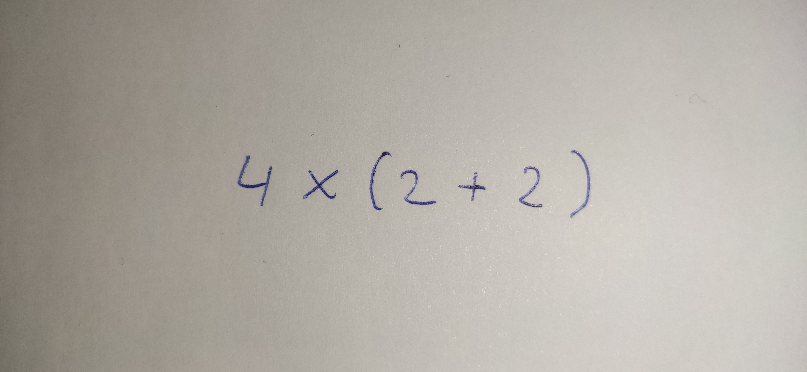
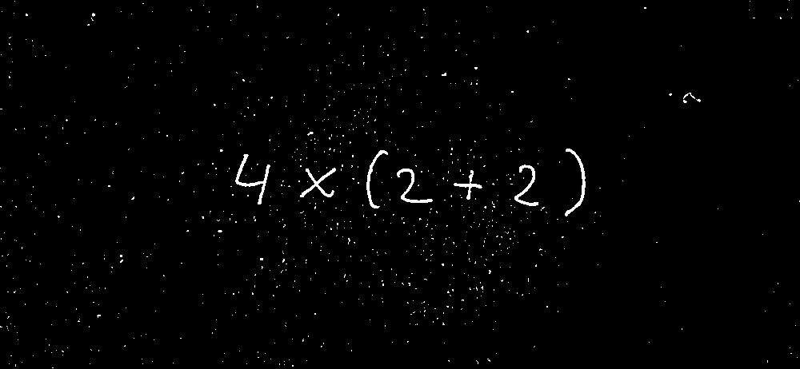

## Table of contents
* [General info](#general-info)
* [Technologies](#technologies)
* [Setup](#setup)
* [Example](#example)

## General info
Computer vision project for solving simple math expressions

## Technologies
Project is created with:
* python version: 3.9
* opencv version: 4.5.1
* tensorflow version: 2.6.0
* keras version: 2.6.0

## Setup
To install required packages for project:

```
$ pip install -r requirements.txt
```

To run app on your localhost:5000:

```
$ python app.py
```

Docker:
```
$ make docker-run
```

## Example

Additional example photos can be found in example_tasks directory



      

Result:
16

